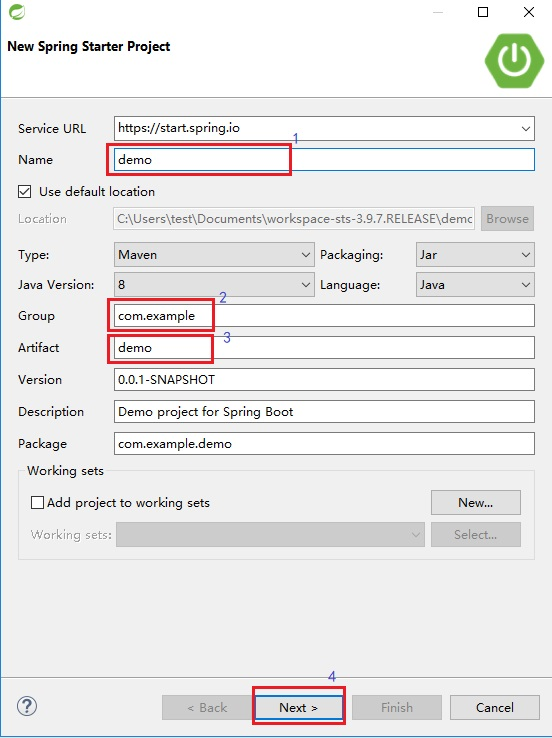
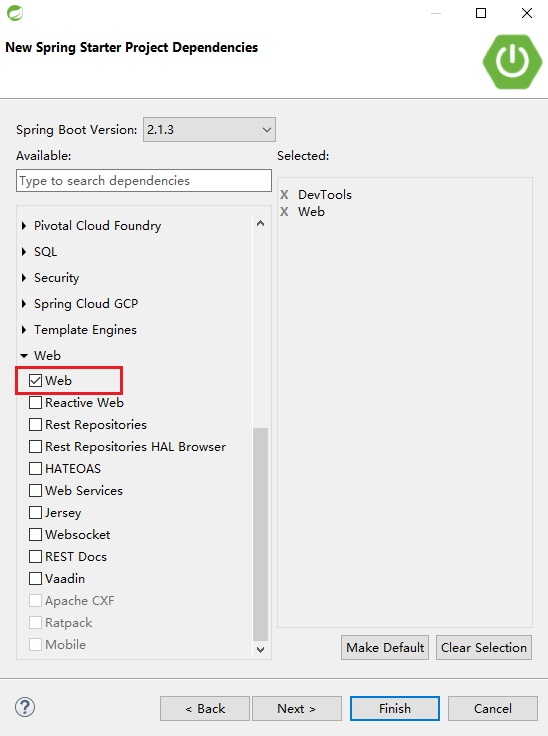
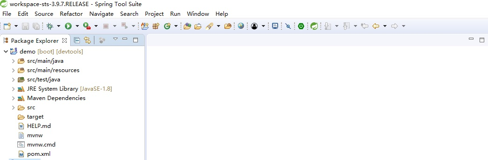
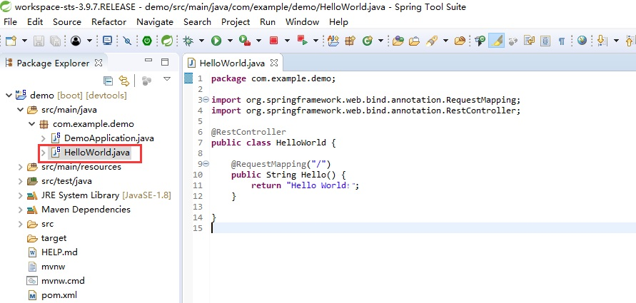
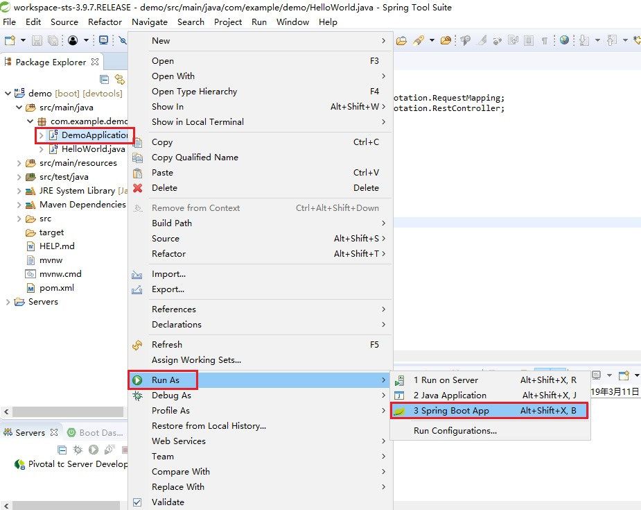

本机环境： java JDK8

## 1、下载  spring-tool-suite

```html
https://spring.io/tools3/sts/legacy
```


## 2、解压运行

```shell
sts-bundle\sts-3.9.7.RELEASE\STS.exe
```


## 3、新建工程

打开 Dashboard,点击 CREATE SPRING STARTER PROJECT


进入 New Spring Starter Project,设置项目名称(Name)、项目 maven 坐标(Group、Artifact),点击 Next




进入 New Spring Starter Project Dependencies,选择项目依赖 jar 包




点击 Finish,进入项目



## 4、Hello World

新建 HelloWorld.java，输入如下代码：

```java
package com.example.demo;

import org.springframework.web.bind.annotation.RequestMapping;
import org.springframework.web.bind.annotation.RestController;

@RestController
public class HelloWorld {

	@RequestMapping("/")
	public String Hello() {
		return "Hello World！";
	}
	
}
```


## 5、运行

选中 DemoApplication.java，右键 Run As -> Spring Boot App


浏览器输入：http://localhost:8080/


完